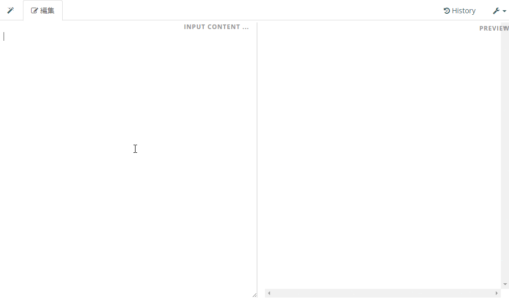

# Crowi + MathJAX

## なにこれ
[Crowi](https://github.com/crowi/crowi) with MathJax



## 使い方
### 修正
以下のコードを `lib/views/layout/layout.html` のそれっぽいところへ挿入
```html
<script type="text/x-mathjax-config">
  MathJax.Hub.Config({ tex2jax: {inlineMath: [['$','$']]} });
</script>
<script type="text/javascript" async src="https://cdn.mathjax.org/mathjax/latest/MathJax.js?config=TeX-MML-AM_CHTML"></script>
<script>
  $(document).ready(function(){
    if($('div#preview-body').size() > 0) {
      var observer = new MutationObserver(function(){MathJax.Hub.Typeset($('div#preview-body')[0]);});
      observer.observe($('div#preview-body')[0], { childList: true, subtree: false });
    }
  });
</script>
```

### Docker([Bakudankun/docker-crowi](https://github.com/Bakudankun/docker-crowi))を使うとき
```shell
docker cp layout.html $(docker ps -q -f 'ancestor=bakudankun/crowi:latest'):/usr/src/app/lib/views/layout/layout.html
```

